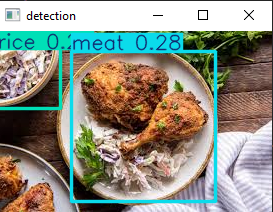
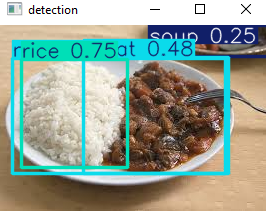
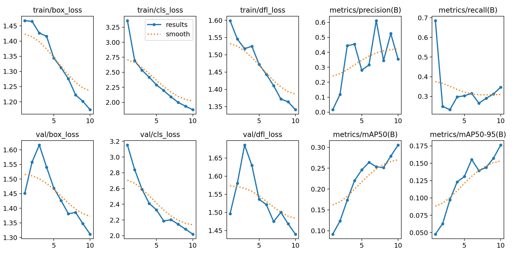

## Task 05: food recognition <YOLO>

## Overview
This task involves implementing YOLO [Yolov8] algorithm.

The objective of this task is to create a YOLO model that can accurately recognize food items from images and estimate their calorie content.

## Model Result

## 💡The benefit of this project:
✅Download the data
✅Data Preparation
✅Apply YOLO [Yolov8] model
✅Evaluate the model
✅Building a calorie estimation system

## Dataset
The dataset is taken from Roboflow website:
https://universe.roboflow.com/nguyen-kim-long/ai-food-detection/dataset/2

## Technologies Used

- Python
- ultralytics
- cv2

## Algorithms

YOLO [Yolov8]

## Acknowledgments

Thanks to Prodigy InfoTech for providing this opportunity to work on such an exciting task